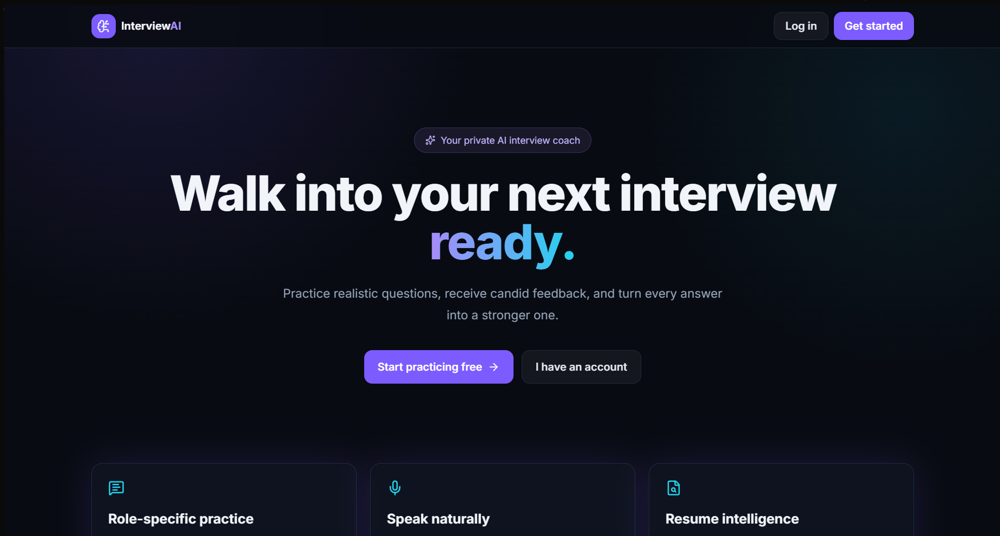
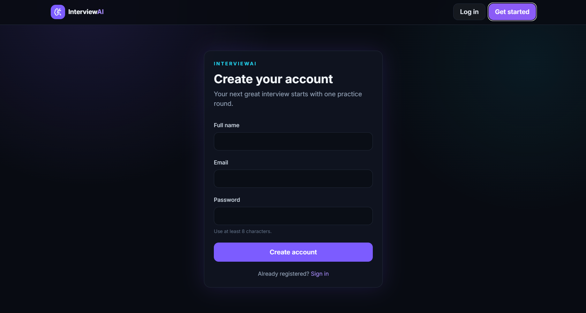
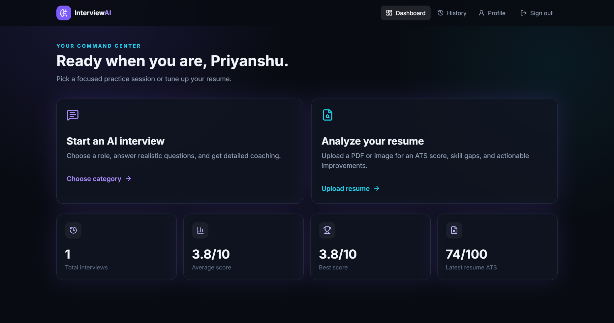
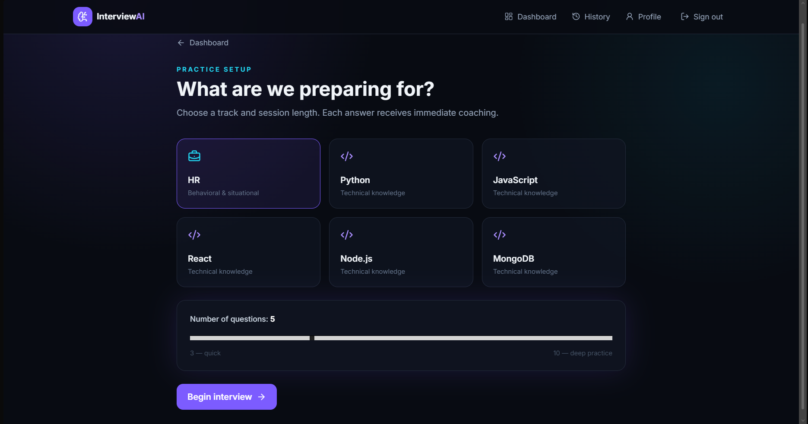
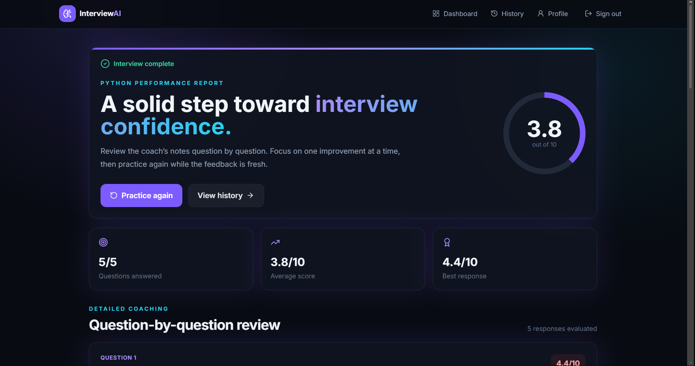
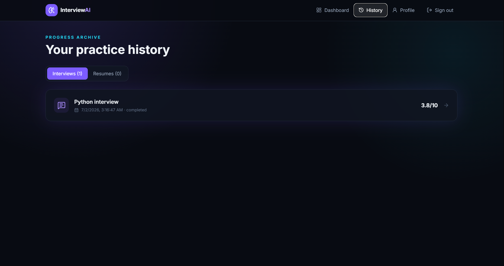
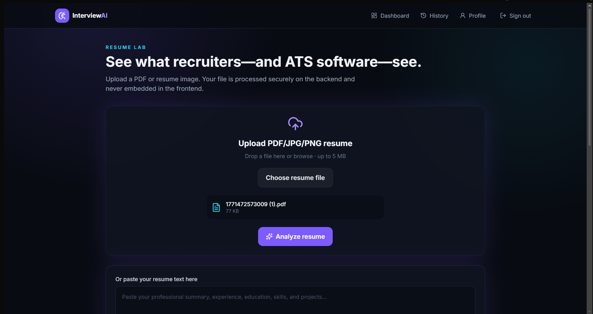
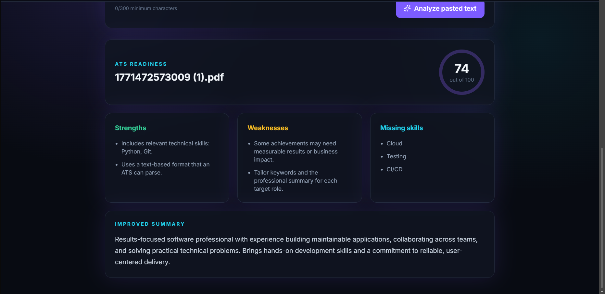

# AI Interview Preparation Platform

A full-stack AI Interview Preparation Platform that helps users practice interviews, get feedback, check scores, analyze resumes, and track interview history.

This project includes user authentication, interview question generation, answer evaluation, resume analysis, scanned PDF OCR support, and interview history tracking.

---

## Features

- User Register and Login
- JWT Authentication
- Protected Dashboard
- AI/Mock Interview Practice
- HR and Technical Interview Categories
- Answer Evaluation with Score
- Feedback and Better Answer Suggestions
- Interview History
- Resume Analyzer
- ATS Score Generation
- OCR Support for Scanned Resume PDFs
- JPG/JPEG/PNG Resume OCR Support
- MongoDB Data Storage
- Responsive Frontend UI

---

## Tech Stack

### Frontend

- React
- Vite
- Tailwind CSS
- React Router
- Axios

### Backend

- Python
- FastAPI
- MongoDB
- JWT Authentication
- PyMuPDF
- Tesseract OCR
- Pytesseract
- Pillow

---

## Hugging Face Spaces deployment

This repository deploys as one Docker Space. The root [Dockerfile](Dockerfile) builds React, copies `frontend/dist` into the FastAPI image, installs Tesseract, and serves the entire application on port `7860`.

Create a Docker Space, upload this repository, and configure these Space secrets/variables:

```text
MONGO_URI=mongodb+srv://...
JWT_SECRET=<long-random-secret>
JWT_ALGORITHM=HS256
ACCESS_TOKEN_EXPIRE_MINUTES=1440
USE_MOCK_AI=true
TESSERACT_CMD=/usr/bin/tesseract
```

`MONGO_URI` and `JWT_SECRET` must be stored as Hugging Face secrets, never committed. Mock mode does not require `OPENAI_API_KEY`. If live AI is enabled later, set `USE_MOCK_AI=false` and add a project-specific `OPENAI_API_KEY` as a Space secret.

The browser calls the backend through same-origin `/api` URLs. FastAPI serves the built React files and falls back to `index.html` for client-side routes.

## Screenshots

### Landing Page



### Login Page



### Dashboard



### Interview Page



### Interview Result



### Interview History



### Resume Analyzer



### Resume ATS Score



---

## Project Structure

```text
AI INTERVIEW/
│
├── backend/
│   ├── app/
│   ├── .env.example
│   ├── requirements.txt
│   └── README.md
│
├── frontend/
│   ├── src/
│   ├── package.json
│   └── README.md
│
├── screenshots/
│   ├── landing-page.png
│   ├── login-page.png
│   ├── dashboard.png
│   ├── interview-page.png
│   ├── result-page.png
│   ├── history-page.png
│   ├── resume-analyzer.png
│   └── resume-score.png
│
├── Dockerfile
├── .dockerignore
├── .gitignore
└── README.md
